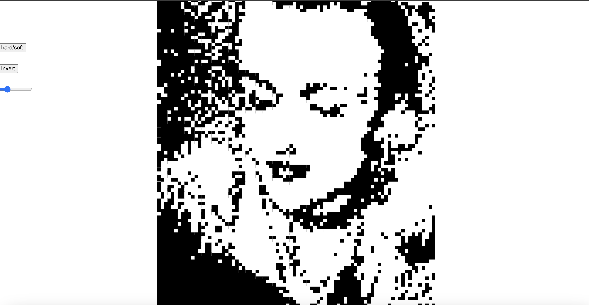

# Template p5 Project

Skyla Trousdale 

[View this project online](https://browneyegirl.github.io/cart253/art-jam/)

## Description

Volume on! Music! Visuals! CLICK ON THE IMAGE TO BEGIN the randomly generated beat, then toggle with the slide to change what tones you hear. The buttons control the visuals. 

This project was my personal exploration of the sound and image library. Some code is commented out from earlier versions and experiments.

## Credits

This project uses [p5.js](https://p5js.org).

- Drums  (Generated, base code sourced from docs: https://p5js.org/reference/p5.sound/p5.Phrase/#:~:text=A%20phrase%20is%20a%20pattern,another%20could%20be%20the%20bassline.)
- Synth Sample (https://freesound.org/people/f-r-a-g-i-l-e/sounds/484045/)
- Everything else original, using application references from the docs. 
- Selfie of me, edited by me. 

