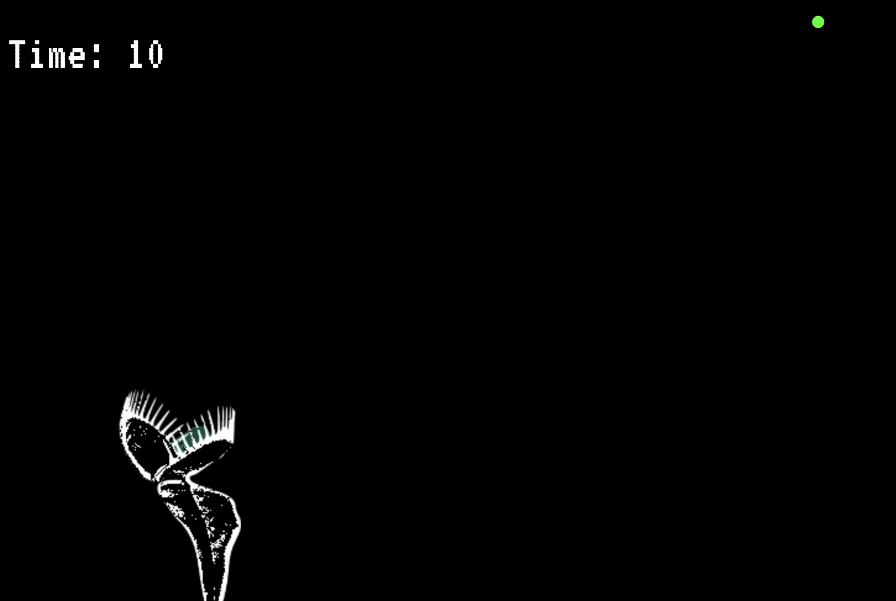
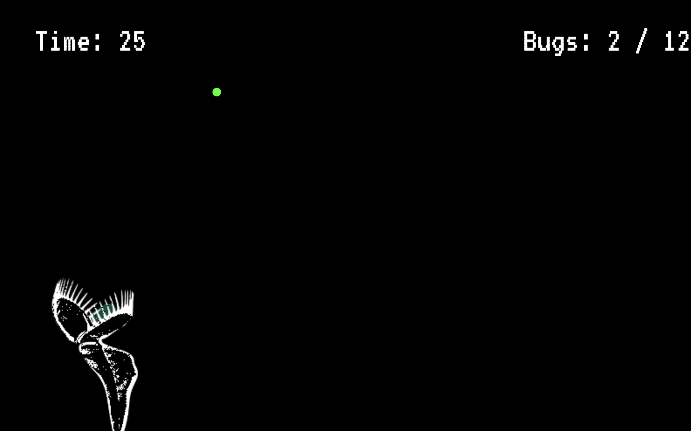
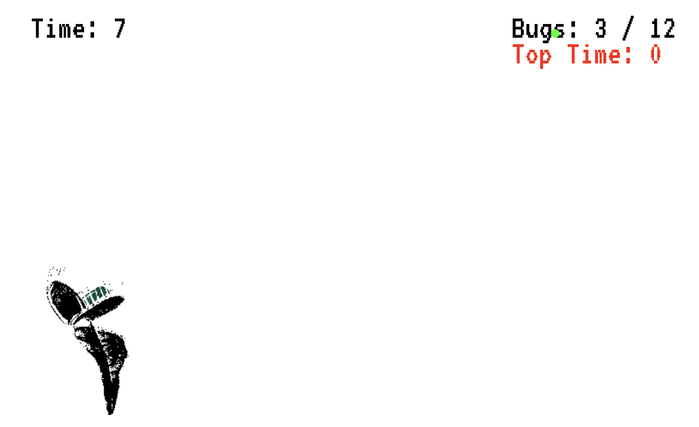
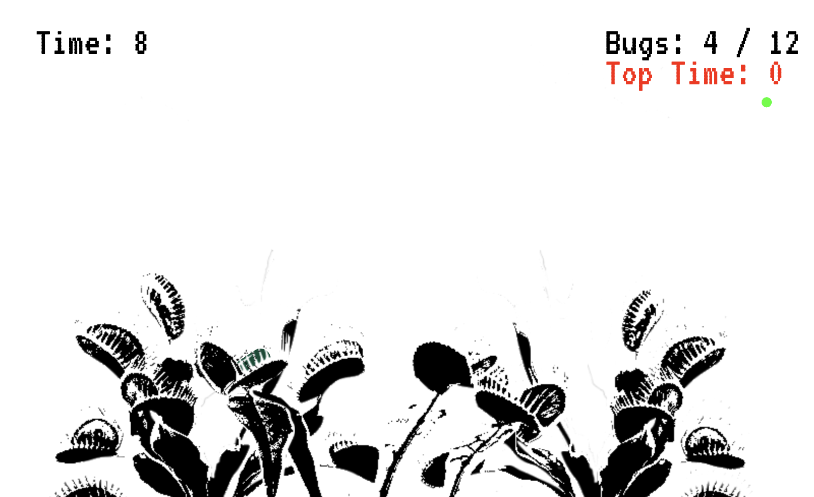
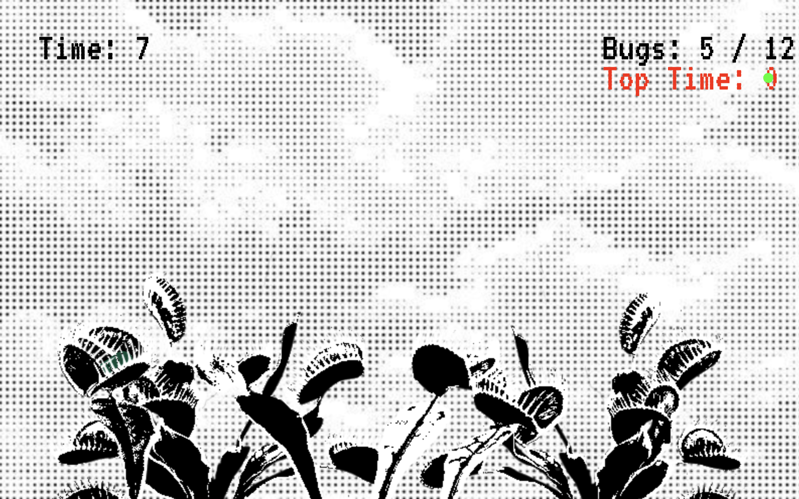
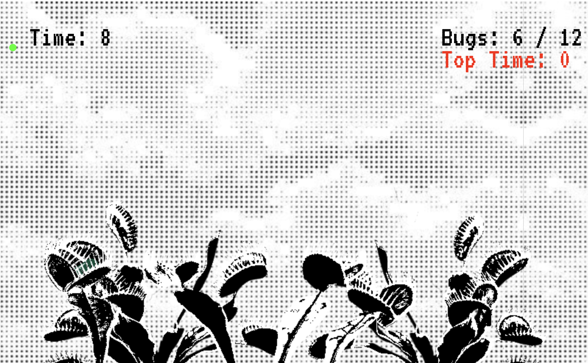
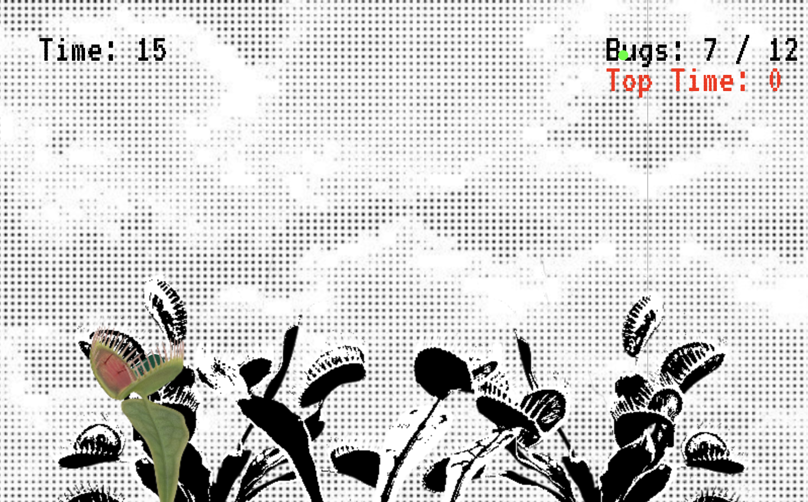
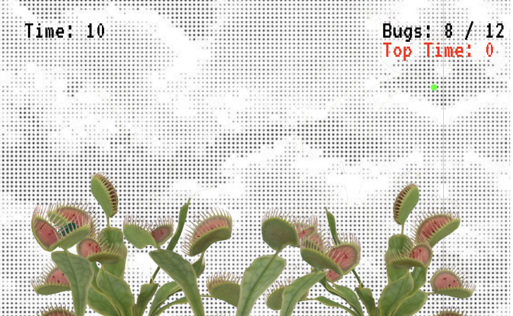
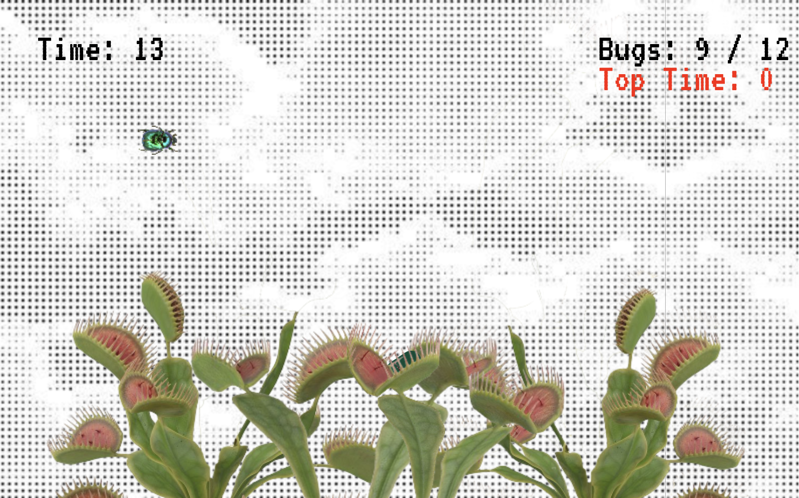
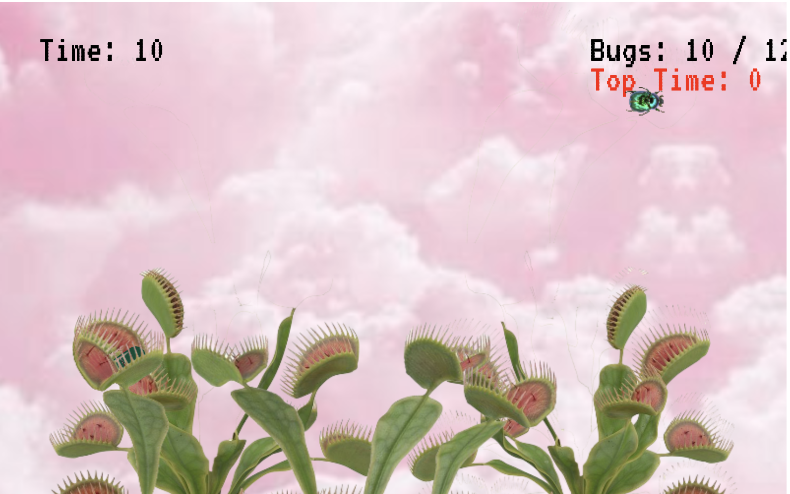

# DEBUGGING
By: Skyla Trousdale 

[Play it!](https://browneyegirl.github.io/cart253/mod-jam-playground/)

## Description

> *DEBUGGING* - Play as a flytrap to debug the game! Whenever you catch a bug, the game debugs itself.

> The experience is contrilled via the arrow keys and mouse clicks, as the user maneuvers the flytrap and tongue to catch all the bugs.  

> The project is meant to transcend the conversational boundary between user and programmer, with the user directly affecting the bugs in the code without interacting with the code itself. 

## Screenshot(s)

> 
> 
> 
> 
> 
> 
> 
> 
> 
> 
> 

## Attribution

This bit should attribute any code, assets or other elements used taken from other sources. For example:

> - This project uses [p5.js](https://p5js.org).
> - The graphic images are sourced on pinterest (exact source unknown). Photos altered by me in photoshop/p5. 

## License

> This project is licensed under a Creative Commons Attribution ([CC BY 4.0](https://creativecommons.org/licenses/by/4.0/deed.en)) license with the exception of libraries and other components with their own licenses.